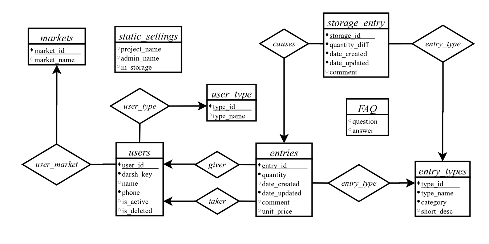
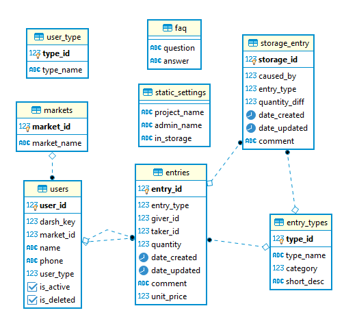

# Fish Buksa Rental System (`FBRS`).
Fish `Buksa` Rental System it's a program that manages the `Buksa` store and records the Storage movements and the delivery, sale, and receipt movements of the registered users in the system.

## Setup.

1.  Make sure you have JDK 1.8 with [Java Development Kit(JDK) 1.8](https://www.java.com/en/download) installed.
2.  Make sure you have [PostgreSQL 12](https://www.postgresql.org/download) installed, and create `fbrs` database in your server.
3.  add file `src/dbconfig.properties` that contain DataBase Properties with this form

        db.serverName=localhost
        db.username=username
        db.password=password
        db.databaseName=fbrs

4.  Build the project and try to fix any damaged references by re-referencing them.

## The Entity-Relationship Model (E-R).

## Schema diagram for the `FBRS` database.

## Copyright
`©2020 OSUMM`